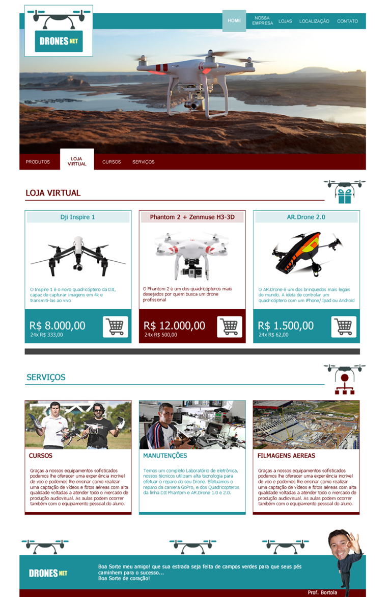

<h1>Aplicando engenharia de software para entender as melhores linguagens de programação em um projeto - Desenvolva o seu primeiro site</h1>

A Chulamis é uma empresa inovadora, focada no desenvolvimento tecnológico da sociedade.

Trabalham fortemente para que as inovações possam fazer toda a diferença nos resultados dos clientes e parceiros.

Apreciam e apoiam um modelo de trabalho moderno, dando liberdade para a criatividade e focando o resultado de uma maneira sustentável e responsável.

O profissionalismo e a qualidade de seus serviços prestados são um diferencial da Chulamis e servem de parâmetro na satisfação dos clientes.

Eles têm como atividade principal a utilização de drones para serviços, treinamentos, vendas e assistência técnica. Contam com uma área de pesquisa e desenvolvimento para atender às demandas de projetos customizados nas quais atuam, desde o levantamento de requisitos até a execução de projetos.

Situada na cidade de São Paulo, a Chulamis atende a todo o território nacional, mas, com isso, precisa reformular todo seu site, que hoje está muito defasado.

A empresa Chulamis contratou o Bortola, um Web Designer bem renomado na área, para desenvolver seu site. O layout foi aprovado pela diretoria, porém o responsável pela identidade visual teve um problema de saúde e não vai conseguir entregar este projeto. Um dos executivos da empresa entrou em contato com a FIAP, para apoiar neste desafio, pois ele sabe que os alunos desta instituição são feras e topam qualquer desafio!   

Com base no que aprendemos nas videoaulas, vamos ajudar a empresa Chulamis a criar esse site de vendas de drones, com alguns serviços adicionais.

Nosso amigo Bortola já deixou algumas especificações prontas (regras) para nos ajudar no desenvolvimento. Lembrando que a diretoria da empresa Chulamis já aprovou esse layout, portanto, precisamos manter a identidade visual.

<h2>OBSERVAÇÕES</h2>

- Seguir a estrutura do layout proposto (figura 2).
- As dimensões podem ser similares, contanto que mantenha a equivalência do modelo.
- Atentem-se às fontes, formatações, textos, disposições nos quadros, quantidades e posições das figuras/fotos.
- Mantenha a mesma estrutura e cores.
- Quanto aos itens do menu, deixar o hover (destaque) ativo quando passar o mouse sobre.

Vamos ao que interessa, vamos ajudar a empresa Chulamis!
