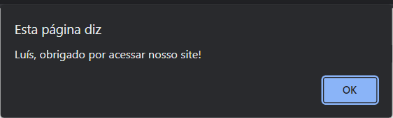

<h1>Utilizando o front integrando o JavaScript com HTML 5 - Primeiro Hands On do Front-end com JavaScript</h1>

Desenvolva um código que, ao abrir a página, apareça um pop-up solicitando o nome completo do usuário, e, logo após dele preencher e finalizar, apareça um segundo pop-up de agradecimento, usando apenas o primeiro nome do usuário (extraído do nome completo digitado no pop-up anterior) e com a seguinte frase: “PrimeiroNome, obrigado por acessar nosso site!”

<h3>1º pop-up:</h3>

<h3>2º pop-up:</h3>

<h2>OBSERVAÇÕES</h2>

- Esta atividade só será aceita se o nome do segundo pop-up for resultado da extração do primeiro nome colhido do primeiro pop-up.
- Caso seja inserido apenas o primeiro nome pelo usuário, o segundo pop-up deverá conter o primeiro nome acompanhado da mensagem de agradecimento.
- Caso o usuário não insira o nome (deixar em branco) no primeiro pop-up e apertar OK, exibir uma mensagem de advertência e não exibir o pop-up com a saudação.
