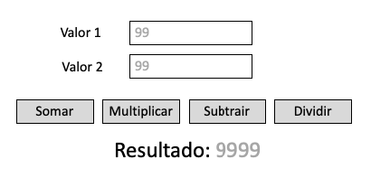

<h1>Já sabe programar JavaScript? - Então vamos utilizar</h1>

Crie um script que colete dois números digitados pelo usuário utilizando campos input na página e os botões “somar”, “subtrair”, “dividir” e “multiplicar”.

Ao clicar nos botões, eles devem executar uma função que verifica qual botão está sendo clicado, faça a operação correspondente e exiba o resultado em um parágrafo!

<h2>OBSERVAÇÕES</h2>

- Caso o ‘Valor 2’ seja 0 (zero), exibir no ‘Resultado’: “Não há divisão por zero”.
- Caso o conteúdo de ‘Valor 1’ ou ‘Valor 2’ esteja em branco, exibir no ‘Resultado:’: “Dados em branco, favor digitar algo!”

<h2>BÔNUS</h2>

Como um bônus no desafio, você pode utilizar seus conhecimentos de estilização e deixar a atividade ainda mais bonita, o que acha?