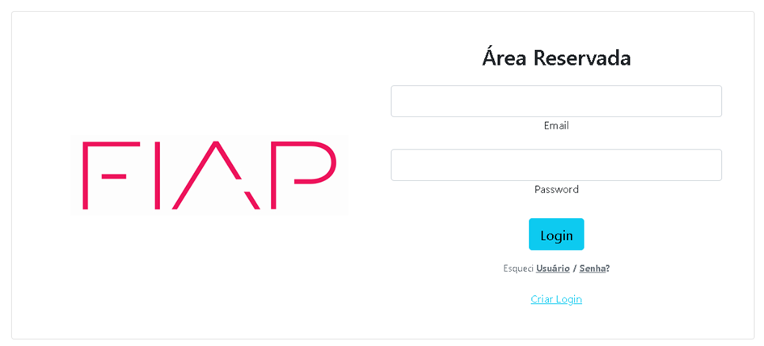
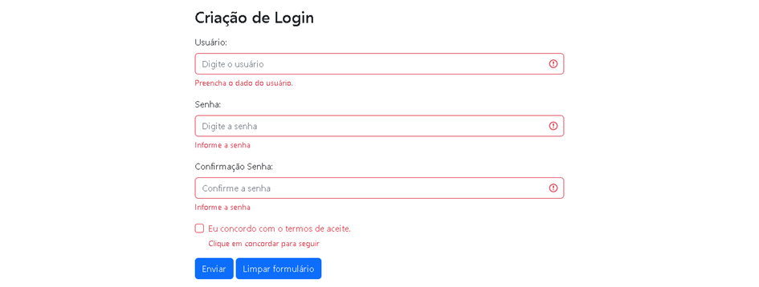
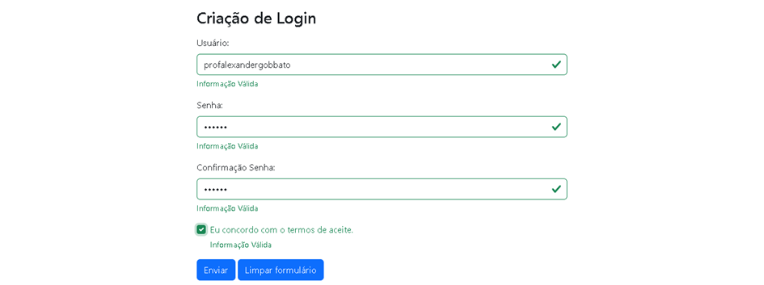

<h1>Um pouco mais de bootstrap</h1>

Com base no framework bootstrap 5, aprendemos alguns elementos como botões, imagens, cores, tabels, layouts e elementos de formulários como campo texto, textarea, checkbox, radio etc., então, agora colocaremos em prática o que foi visto. Qual será o nosso desafio?

- Criar uma tela (um arquivo .html) de login conforme imagem abaixo (Deixar o mais parecido possível com a tela):

(Para a imagem da FIAP, você pode buscar no google imagens e não precisa ser exatamente com essa qualidade, pois não iremos avaliar a qualidade da imagem.)

- Ao clicar em “Criar Login” na tela anterior, aparecerá a tela abaixo (outro html). Criar uma tela de layout responsivo como formulário para a criação de um login, veja as imagens abaixo (respeitar as cores e as mensagens sugeridas depois da digitação dos campos):

